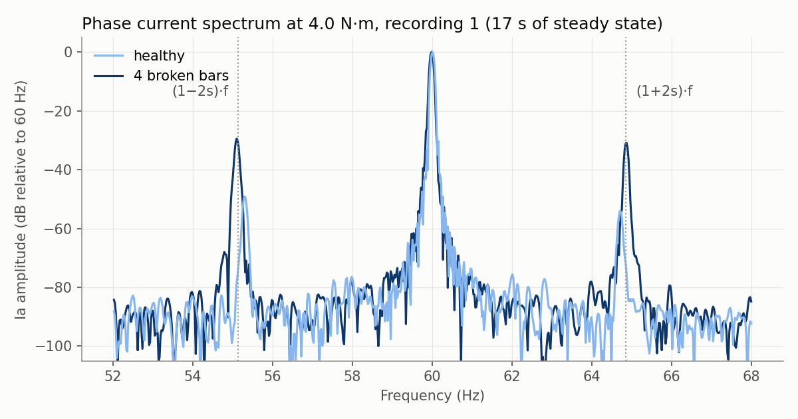
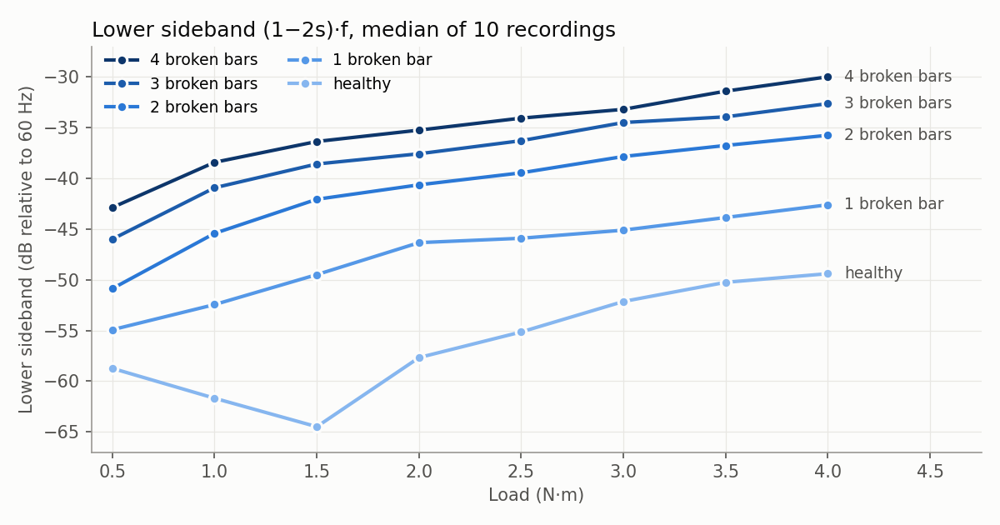

# IEEE broken rotor bar dataset: what the data shows

This document gives the results of a check of all 400 recordings in the IEEE dataset. It tells you:

- what each signal contains
- which features you can extract, and how much each feature changes with broken bars
- which features identify the test session and not the broken bars
- which recordings have problems

For the download, the conversion and the pipeline, see [IEEE.md](IEEE.md).

## How we did the check

We read all five `.mat` files with `h5py`. For each recording, we used the constant-speed part, from sample 150,000 to sample 1,001,000. This is 17.02 s of data.

- **Spectrum.** We applied a Hann window and an FFT of 2^21 points. The frequency resolution is about 0.06 Hz.
- **Speed.** We found the rotation frequency from the largest peak near 29 Hz in the `Vib_carc` signal.
- **Slip.** We calculated slip from the speed: s = 1 − 2 · f_rot / f. The motor has 2 pole pairs.
- **Values in the tables.** Each value is the median of the 10 recordings for that rotor and load level.
- **Accuracy values.** We used 5-fold cross-validation with one row for each recording (397 recordings, after we removed 3 bad recordings). A random guess gives 0.20.

### Terms

These terms are in addition to the terms in [IEEE.md](IEEE.md#terms).

| Term | Meaning |
|---|---|
| Fundamental | The 60 Hz part of the phase current |
| f | The supply frequency. In this dataset, f is 59.95 – 60.01 Hz. |
| Slip (s) | How much slower the rotor turns than the magnetic field. s = 0 at no load. |
| Sideband | A small peak in the current spectrum near the fundamental. Broken bars cause sidebands at (1 − 2s)·f and (1 + 2s)·f. |
| LSB, USB | The lower sideband (1 − 2s)·f and the upper sideband (1 + 2s)·f |
| dB rel. 60 Hz | The amplitude of a peak divided by the amplitude of the fundamental, in decibels. −40 dB is 1% of the fundamental. |
| Test session | One period of tests with one rotor installed in the motor. Each rotor has its own test session. |

## The signals in each recording

| Signal | Sample rate | What we see |
|---|---|---|
| `Ia`, `Ib`, `Ic` | 50 kHz | Phase currents. At constant speed: 1.02 – 1.73 A RMS. At start: peaks of 16 – 18 A. |
| `Va`, `Vb`, `Vc` | 50 kHz | Phase-to-neutral voltages. 124 – 128 V RMS (about 220 V line-to-line), 59.95 – 60.01 Hz. The voltage and the current start at the same sample. |
| `Vib_acpe`, `Vib_acpi`, `Vib_axial`, `Vib_base`, `Vib_carc` | 7,667 Hz | Five vibration signals. The `.mat` files do not give the units. `Vib_axial` is about 20 times smaller than the other four signals. |
| `Trigger` | 7,667 Hz | About 6.2 V before the motor starts. About 0.05 V after the motor starts. |

### The vibration signals have different lengths

The number of vibration samples changes from 142,559 to 153,741. The sample rate does not change. We know this because the rotation peak is at the same frequency in long and short recordings of the same rotor and load level.

The short recordings do not have samples at the start. The last sample of each vibration signal is at the same time as the last sample of the current. To align the vibration with the current, count from the end of the signal.

## The motor start

The motor starts at a different sample in some recordings:

| Start sample | Number of recordings |
|---|---|
| 99,000 – 101,000 | 392 |
| 88,970 – 94,798 | 6 |
| 140,133 | 1 (`rs_torque15_10`) |

The start takes 213 – 265 ms. The start takes more time at higher load levels.

**Caution:** In `rs_torque15_10`, the start current continues until about sample 151,800. A part that starts at sample 150,000 includes some start current. To be safe, start at sample 160,000, or find the start sample in each recording.

The start time and the start current peak do not change in a clear sequence with the number of broken bars. Do not use them as fault features without more work.

## Features you can extract

### 1. Broken-bar sidebands: the best feature

A broken bar stops the current in that bar. The current in the rotor is then not symmetrical. This adds two small peaks to the stator current at (1 − 2s)·f and (1 + 2s)·f.

The healthy rotor also has sidebands. No real rotor is fully symmetrical. The sidebands of the healthy rotor are 20 dB smaller than the sidebands of the rotor with 4 broken bars.

**Lower sideband (1 − 2s)·f, dB rel. 60 Hz:**

| Rotor | 0.5 | 1.0 | 1.5 | 2.0 | 2.5 | 3.0 | 3.5 | 4.0 N·m |
|---|---|---|---|---|---|---|---|---|
| `rs` (healthy) | −58.7 | −61.7 | −64.5 | −57.7 | −55.1 | −52.1 | −50.2 | −49.4 |
| `r1b` | −54.9 | −52.4 | −49.5 | −46.3 | −46.0 | −45.1 | −43.9 | −42.6 |
| `r2b` | −50.9 | −45.4 | −42.1 | −40.6 | −39.4 | −37.8 | −36.7 | −35.7 |
| `r3b` | −46.0 | −40.9 | −38.6 | −37.6 | −36.3 | −34.5 | −33.9 | −32.6 |
| `r4b` | −42.9 | −38.4 | −36.4 | −35.2 | −34.0 | −33.2 | −31.4 | −30.0 |

**Upper sideband (1 + 2s)·f, dB rel. 60 Hz:**

| Rotor | 0.5 | 1.0 | 1.5 | 2.0 | 2.5 | 3.0 | 3.5 | 4.0 N·m |
|---|---|---|---|---|---|---|---|---|
| `rs` (healthy) | −55.7 | −54.0 | −53.3 | −53.5 | −53.6 | −53.0 | −53.6 | −54.1 |
| `r1b` | −53.4 | −50.1 | −48.2 | −45.8 | −46.3 | −45.0 | −44.9 | −44.1 |
| `r2b` | −48.3 | −44.1 | −41.3 | −40.0 | −40.2 | −38.4 | −38.1 | −39.1 |
| `r3b` | −45.2 | −39.5 | −37.1 | −35.7 | −35.5 | −34.1 | −34.6 | −34.9 |
| `r4b` | −42.5 | −37.6 | −35.1 | −33.9 | −33.1 | −33.6 | −32.0 | −31.4 |

What we see:

- At each load level, the sideband level increases with each broken bar. The order is the same at all 8 load levels.
- The sideband level also increases with load. Thus a sideband level alone does not give the class. You must also know the load level or the slip.
- The difference between the healthy rotor and `r1b` is 3.8 dB at 0.5 N·m. At the other load levels it is 6 – 15 dB. One broken bar at low load is the most difficult case.
- In the recordings of one rotor at one load level, the standard deviation of the lower sideband is 1.7 dB or less. (We removed the 3 bad recordings first.) The exception is the healthy rotor at 0.5 N·m: 4.5 dB.
- The noise floor near the sidebands is −80 to −92 dB rel. 60 Hz.
- The second sidebands at (1 ± 4s)·f are near the noise floor (−68 to −87 dB). They are not useful, except possibly for `r4b` at 4.0 N·m (−68 dB).

Accuracy with only these features (random forest, 5 classes):

| Features | Accuracy |
|---|---|
| LSB only | 0.51 |
| LSB + USB | 0.72 |
| LSB + USB + load level | 0.92 |
| LSB + USB + slip | 0.92 |

**You must have seconds of data to see the sidebands.** The sidebands are 2s·f from the fundamental. This distance is 0.65 Hz at 0.5 N·m and 5.0 Hz at 4.0 N·m. With a Hann window of length T, a peak is 2/T Hz wide on each side. To separate the sideband from the fundamental at 0.5 N·m, T must be more than 3 s. At 4.0 N·m, T must be more than 0.4 s.

### 2. Slip and speed

| Load level (N·m) | 0.5 | 1.0 | 1.5 | 2.0 | 2.5 | 3.0 | 3.5 | 4.0 |
|---|---|---|---|---|---|---|---|---|
| Speed (rpm) | 1,790 | 1,782 | 1,774 | 1,765 | 1,757 | 1,748 | 1,737 | 1,727 |
| Slip | 0.005 | 0.010 | 0.014 | 0.019 | 0.023 | 0.028 | 0.035 | 0.041 |

- Slip shows the load. It does not show the broken bars by itself.
- At 4.0 N·m, slip increases a little with broken bars: 0.0405 for `rs` and 0.0419 for `r4b`. This difference is too small to use as a feature.
- You must know the slip to find the sidebands. You can get the slip from the vibration rotation peak, or from the position of the LSB in the current spectrum.
- In `r1b_torque25_05`, the vibration signal has a 30.0 Hz peak that is larger than the rotation peak. The slip from the vibration is then wrong (0.0998). For this recording, get the slip from the current.

### 3. Current level, power and balance

**Phase current `Ia`, A RMS:**

| Rotor | 0.5 | 1.0 | 1.5 | 2.0 | 2.5 | 3.0 | 3.5 | 4.0 N·m |
|---|---|---|---|---|---|---|---|---|
| `rs` | 1.060 | 1.088 | 1.142 | 1.220 | 1.282 | 1.390 | 1.534 | 1.651 |
| `r1b` | 1.106 | 1.127 | 1.172 | 1.258 | 1.345 | 1.428 | 1.559 | 1.688 |
| `r2b` | 1.020 | 1.051 | 1.112 | 1.200 | 1.299 | 1.409 | 1.529 | 1.654 |
| `r3b` | 1.046 | 1.078 | 1.124 | 1.203 | 1.318 | 1.414 | 1.553 | 1.702 |
| `r4b` | 1.116 | 1.138 | 1.204 | 1.286 | 1.366 | 1.467 | 1.598 | 1.726 |

- The current increases with load.
- The current does not increase in sequence with the number of broken bars. `r2b` has the lowest current and `r4b` has the highest current. Each rotor has its own offset.
- Active power is 264 – 288 W at 0.5 N·m and 617 – 635 W at 4.0 N·m. The power factor is 0.66 – 0.69 at 0.5 N·m and 0.98 – 0.99 at 4.0 N·m. For the healthy rotor, you must correct the voltage channels first (see [Data problems](#data-problems)).
- The difference between the three phase currents is 1 – 8%. It decreases with load. It does not change in sequence with the broken bars.

### 4. Harmonics

- The total harmonic distortion of the current is 12% at 0.5 N·m and 6 – 7.5% at 4.0 N·m.
- The 5th and 7th harmonics are −27 to −33 dB rel. 60 Hz.
- These values do not change in a clear sequence with the number of broken bars.

### 5. Vibration

**`Vib_carc`, RMS (units not given):**

| Rotor | 0.5 | 1.0 | 1.5 | 2.0 | 2.5 | 3.0 | 3.5 | 4.0 N·m |
|---|---|---|---|---|---|---|---|---|
| `rs` | 3.9 | 6.6 | 8.9 | 10.7 | 12.0 | 13.2 | 14.2 | 14.9 |
| `r1b` | 4.3 | 8.0 | 10.6 | 12.6 | 13.7 | 14.4 | 15.1 | 15.7 |
| `r2b` | 2.4 | 5.2 | 6.5 | 7.2 | 8.1 | 9.0 | 9.7 | 10.0 |
| `r3b` | 4.3 | 4.5 | 5.4 | 8.2 | 9.6 | 9.9 | 10.2 | 11.1 |
| `r4b` | 7.8 | 11.8 | 13.7 | 16.0 | 17.4 | 18.2 | 19.0 | 19.8 |

- The vibration increases with load.
- The vibration does not increase in sequence with the number of broken bars. `r2b` has the lowest vibration and `r4b` has the highest vibration. The other four vibration signals also have a different order for each rotor.
- But the five vibration RMS values and the load level together give an accuracy of **1.00**. The next section tells why this result is not a fault detection.

## Features that identify the test session, not the broken bars

The operators installed each rotor in the motor for a different test session. Thus each class comes from one test session. Some conditions change from one session to the next: the mechanical assembly, the sensor positions and the supply voltage. A feature that measures these conditions can identify the class without any information about the broken bars.

| Features | Physical link to broken bars | Accuracy |
|---|---|---|
| 5 vibration RMS values + load level | None found. The values are not in sequence with the broken bars. | 1.00 |
| LSB + USB + load level | Yes. Theory and the data agree. | 0.92 |
| `Ia` RMS + load level | Weak. The values are not in sequence with the broken bars. | 0.78 |
| `Va`, `Vb`, `Vc` RMS | None. The supply voltage comes from the grid. | 0.72 |
| THD + 5th + 7th harmonic + load level | None found | 0.65 |

The supply voltage has no physical link to the rotor. But the voltage alone gives an accuracy of 0.72, and a random guess gives 0.20. This shows that the classes are different in conditions other than the broken bars.

What this means for the pipeline:

- A high accuracy does not prove that a model detects broken bars. The model can learn the test session.
- The tsfresh features in `tsfresh_features_IEEE.py` include the signal level (`abs_energy`, `root_mean_square`, `standard_deviation`, `maximum`, `minimum`). These features measure the current level, and the current level has a different offset for each rotor.
- Use features that are relative to the fundamental (dB rel. 60 Hz). These features do not change with a small change in the current level.
- Train the same classifier on the voltage RMS only. Use the result as a baseline. A good model must be much better than this baseline.

## Why the window features cannot see the sidebands

The notebook uses windows of 1,024 samples at 50 kHz. Each window is 20.48 ms long, which is 1.2 supply cycles. The notebook then averages pairs of samples, so each window has 512 samples at 25 kHz.

The FFT of a 20.48 ms window has one value for each 48.8 Hz. The tsfresh features `fft_coefficient` 1 to 10 are at 48.8, 97.7, 146.5 … 488 Hz. The fundamental (60 Hz) is between the first and the second value.

The sidebands are 0.65 – 5.0 Hz from the fundamental. This is less than 1/9 of the distance between two FFT values. Thus the window features cannot separate the sidebands from the fundamental.

To use the sidebands, calculate the sideband features on a long part of each recording (more than 3 s, and 10 s or more is better). Or use windows that are longer than 3 s.

## Data problems

[IEEE.md](IEEE.md#known-problems-in-the-data) gives the first two problems. This check found three more problems.

| Recording | Problem | What to do |
|---|---|---|
| All | The motor is off for the first 2 s. | Start at sample 160,000. |
| `rs_torque05_09` | Only sensor noise (0.008 A). | Remove it. |
| `r4b_torque40_10` | `Ia` and `Va` are copies of `r4b_torque05_01`. The current is 1.12 A and the slip is 0.004, which agrees with 0.5 N·m. The vibration signals are not copies. | Remove it. Or move it to load level 0.5 N·m and do not use its vibration. |
| `rs_torque15_10` | The motor starts at sample 140,133, not 100,000. | Start at sample 160,000. |
| All `rs` recordings | `Va` and `Vb` are probably swapped. | Swap `Va` and `Vb` in `rs` before you use voltage and current together. |

### The voltage channels in the `rs` file

In the `r1b` to `r4b` files, `Vb` is 120° ahead of `Va`. In the `rs` file, `Vb` is 120° behind `Va`. The order of the phase currents is the same in all five files. Thus the voltage labels in the `rs` file are different from the other files.

With the labels as they are, the active power for `rs` at 4.0 N·m is 0 W. When we pair `Ia` with `Vb` and `Ib` with `Va`, the active power is 614 W. This agrees with the other rotors (617 – 635 W).

This problem has no effect on the pipeline now, because the pipeline uses only the currents. If you add the voltages, the phase angle between voltage and current identifies the healthy rotor without any information about the broken bars. Correct the labels first.

## Summary of features

| Feature | Changes with broken bars | Changes with load | Use it? |
|---|---|---|---|
| LSB and USB level (dB rel. 60 Hz) | Yes, in sequence | Yes | Yes. Use it with the load level or the slip. Use more than 3 s of data. |
| Slip, speed | Very little | Yes | Use it to find the sidebands and to show the load. |
| Current RMS | Not in sequence | Yes | Use with caution. It can identify the test session. |
| Active power, power factor | Not in sequence | Yes | Correct the `rs` voltages first. |
| Phase current balance | No | Yes | No |
| THD, 5th and 7th harmonics | No | Yes | No |
| Second sidebands (1 ± 4s)·f | Only at 4 broken bars, 4.0 N·m | Yes | No |
| Start time, start current peak | No clear sequence | Yes | Not without more work |
| Vibration RMS | Not in sequence | Yes | No. It identifies the test session. |
| Supply voltage RMS | No physical link | Very little | No. Use it only as a baseline. |
